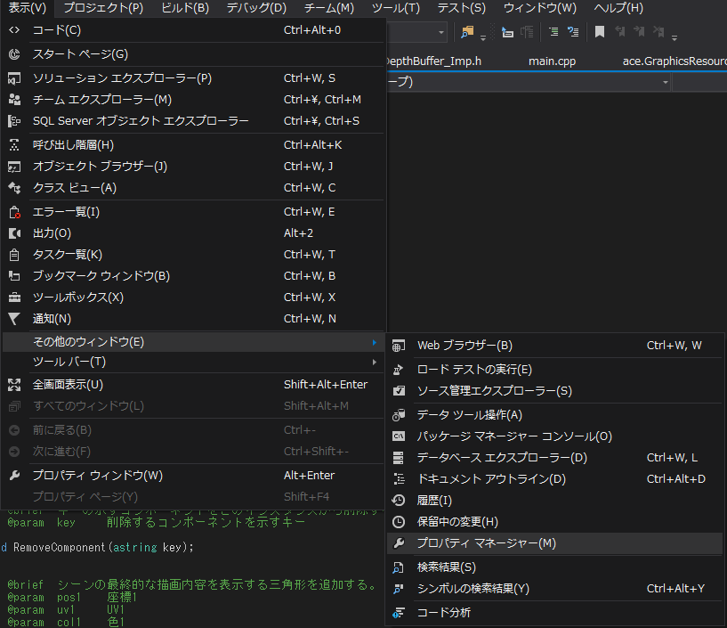
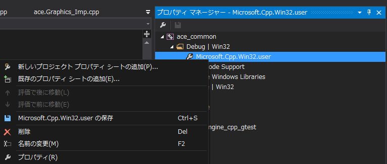

# DirectXSDKへのパスの通し方

プロパティ マネージャーマネージャーを起動します。

Microsoft.Cpp.Win32.userのプロパティを起動します。

VC++ ディレクトリを開き、インクルードディレクトリにDirectX SDKのインクルードファイルへのパスを追加します。

デフォルトのインストール先なら「C:\Program Files (x86)\Microsoft DirectX SDK (June 2010)\Include」です。

ライブラリディレクトリにDirectX SDKのインクルードファイルへのパスを追加します。

x86のデフォルトのインストール先なら「C:\Program Files (x86)\Microsoft DirectX SDK (June 2010)\Lib\x86」です。

