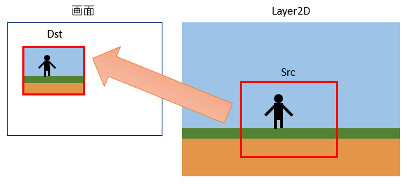

## カメラオブジェクト2D (CameraObject2D)

### 概要

[オブジェクト2Dクラス](./Object2D.md)を拡張し、レイヤー2Dの一部の領域のみを画面に描画できるようにする2D描画オブジェクトクラスです。
レイヤー2Dをカメラで撮影して、撮影結果を画面に表示します。例えば、アクションゲームでプレイヤーの動作に合わせて全ての背景や敵キャラクターを動かすのではなく、カメラのみを動かすことにより処理量が少なく、かつわかりやすい実装を実現します。

プロパティにはSrcとDstが存在が存在します。図で示すように、Srcは描画元となる撮影される領域、Dstは描画先となる画面上の領域になります。これらのサイズは任意で拡大縮小、横方向のみに拡大して描画といった変形もできます。

また、Srcの位置はカメラオブジェクトの位置・回転・拡大の値によって変化します。例えばカメラオブジェクトが右に移動した場合、Srcの位置も右に移動します。キャラクターの位置にあわせてカメラオブジェクトを移動しキャラクターを常に画面の中心に表示するといった使い方に使用できます。

### 主なメソッド

なし

### 主なプロパティ

| 名称 | 説明 |
|---|---|
| Src | 描画元 |
| Dst | 描画先 |

### 主なイベント

なし

### 使用方法

CameraObject2Dクラスのサンプルです。

* include_basic_sample CameraObject2D_Basic