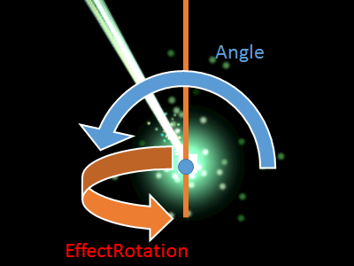

## エフェクトオブジェクト2D (EffectObject2D)

### 概要

[オブジェクト2Dクラス](./Object2D.md)を拡張し、エフェクトを描画できるようにした2D描画オブジェクトクラスです。Effekseerで作成されたエフェクトを設定し、そのエフェクトを描画します。このオブジェクト自体がエフェクトでなく、エフェクトをコントロールする役目を持っています。そのため、一度エフェクトを表示すれば終わりでなく、何度もエフェクトを表示できます。また、生成されたエフェクトの位置を制御でき、例えばビームサーベルといったエフェクトを生成した後も位置を変更するエフェクトを表示する際、エフェクトオブジェクトの位置や角度を変更することでエフェクトを制御できます。その一方、エフェクトオブジェクトはエフェクトの再生が終わっても自動的に削除されないため、注意が必要です。

エフェクトはかなり大きめにする必要があります。Effekseerの出力時に倍率を設定するか、Scaleを変更して10～20倍程度にするとわかりやすい大きさになる場合が多いです。

エフェクト自体は3Dで製作されていますが、エフェクトオブジェクト2Dは2D描画しかできません。そのため、エフェクトの内容によっては意図しない見栄えになることもあります。例えば、レーザーが画面の横に出て欲しいのに画面の外側に向かってしまう、斬撃の見栄えが悪い、などです。そのような場合、EffectRotationを設定します。これはエフェクトを再生する時のエフェクトのY軸に対する回転方向であり、この値を変更することでエフェクトが時計回りに回転し画面の外側に向かうエフェクトを横方向に向かうよう変更できます。

Angleは画面の正面方向を軸に時計回り、EffectRotationは画面の上方向を軸に時計回りです。

エフェクトには再生を開始したらその場にとどまって欲しい場合とオブジェクトにそって移動して欲しい場合があります。例えば、前者はヒットエフェクト、後者はビームサーベルです。SyncEffectsを切り替えることでこの2つを切り替えられます。SyncEffectsがtrueの場合、オブジェクトが移動するとエフェクトも一緒に移動します。ただし、エフェクトの内容によってはうまくいかない場合があります。

### 主なメソッド

| 名称 | 説明 |
|---|---|
| Play | 設定されているエフェクトを再生します。 |
| Stop | このオブジェクトから再生されたエフェクトを全て停止します。 |

### 主なプロパティ

| 名称 | 説明 |
|---|---|
| Effect | 描画に使用するエフェクト |
| EffectRotation | このオブジェクトから再生されるエフェクトの向き(度) |
| SyncEffects | エフェクトがオブジェクトに同期して移動するか |

### 主なイベント

なし

### 使用方法

EffectObject2Dクラスのサンプルです。

* include_basic_sample EffectObject2D_Basic