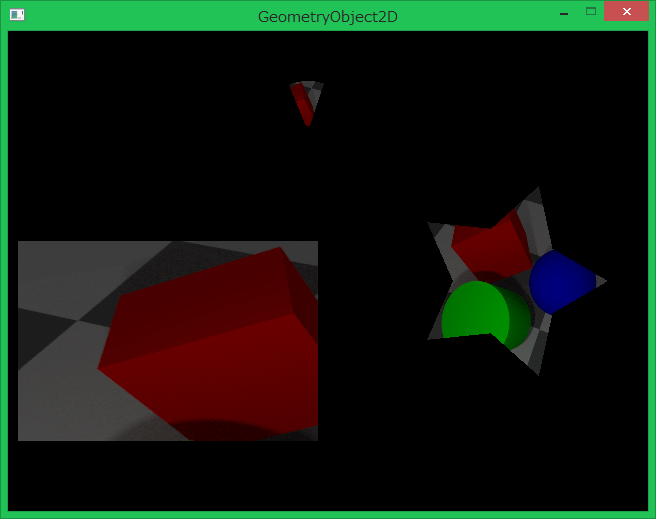

## 図形オブジェクト2D (GeometryObject2D)

### 概要

[オブジェクト2Dクラス](./Object2D.md)を拡張し、[図形クラス](./Shape.md)を持った上でそれを描画できる2D描画オブジェクトです。
下の図のように、描画する図形にテクスチャを合成することも可能です。

具体的には、Shapeプロパティに描画したい図形を設定すると、その形状の情報をもとに図形を描画します。

また、図形が[線分](./LineShape.md)以外の形状の時は、指定したテクスチャを図形に合成することが可能です。

### 主なメソッド

なし

### 主なプロパティ

| 名称 | 説明 |
|---|---|
| Shape | 描画する図形のハンドル |
| Texture | 描画する2Dテクスチャのハンドル |
| AlphaBlendMode | 図形描画の際に適用されるアルファブレンドの種類 |
| CenterPosition | 図形に適用する変換(拡大、回転、移動)の基準位置(親から見た相対座標にて設定) |
| Color | 図形描画の際の合成色のRGBA値を0~255の間で指定(Aの値を255未満にすると透明になる。)|
| DrawingPriority | 描画の優先順位|
| TextureFilterType | 描画時のテクスチャフィルタ(近傍補間:Nearestもしくは線形補間:Linear) |

### 主なイベント

なし

### 使用方法

GeometryObject2Dクラスのサンプルです。

* include_basic_sample GeometryObject2D