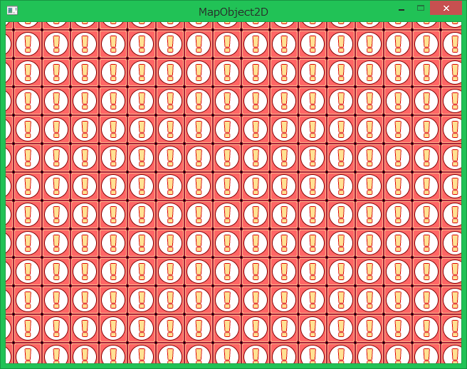

## マップオブジェクト2D (MapObject2D)

### 概要

[オブジェクト2Dクラス](./Object2D.md)を拡張し、チップを複数持った上でそれらを全て一括で高速に描画できる2D描画オブジェクトです。
同じくテクスチャを描画する[テクスチャオブジェクト2D](./TextureObject2D.md)の場合は、描画するテクスチャの数だけそのインスタンスを生成する必要があります。しかし、テクスチャオブジェクト2DはOnUpdateメソッドを呼び出す分、その数が増えるとゲームに対して甚だしい負荷がかかります。そこで、このマップオブジェクト2Dはテクスチャと描画の情報をまとめたチップを複数持つことで、OnUpdateメソッドを一度しか呼び出さずに複数のテクスチャを描画することができ、ゲームに掛かる負荷を減らすことが出来ます。図に示すように大量の画像も高速に描画できます。

描画対象とするチップはAddChipにて追加、RemoveChipにて削除することが出来ます。

アクションゲームにおいて、マップチップや背景オブジェクトなどのゲーム中にてほぼ更新する必要はないが大量に描画する必要があるテクスチャを扱うのにこのマップオブジェクト2Dは適しています。逆にプレイヤーや敵キャラクターなど毎フレーム更新するオブジェクトを扱うには、[テクスチャオブジェクト2D](./TextureObject2D.md)が適しています。

チップの作成や設定については、[チップ](./Chip2D.md)の項を御覧ください。

### 主なメソッド

| 名称 | 説明 |
|---|---|
| AddChip | チップを描画対象として追加する (追加成功か否かが返り値)|
| RemoveChip | チップを描画対象から削除する(削除成功か否かが返り値)|
| Clear | 保持しているチップを全て破棄する。|

### 主なプロパティ

| 名称 | 説明 |
|---|---|
| CenterPosition | 描画の際に適用する変換(拡大、回転、移動)の基準位置。(親から見た相対座標にて設定) |
| DrawingPriority | 描画の優先順位|
| Chips | 保持しているチップ一覧を返す。|

### 主なイベント

なし

### 使用方法

MapObject2Dクラスのサンプルです。

* include_application_sample MapObject2D_Basic
