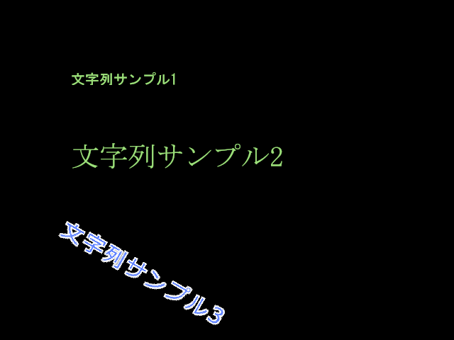

## テキストオブジェクト2D (TextObject2D)

### 概要

[オブジェクト2Dクラス](./Object2D.md)を拡張し、文字列を描画することが可能な2D描画オブジェクトです。

最低限、描画に使用するフォントと描画する文字列を設定すると図に示すように文字列の左上を基準に文字列を描画することが出来ます。フォントの設定によって図に示すように文字サイズが設定でき、枠線付き文字の描画や文字列の回転も可能です。

他にも文字列の描画方向、描画色、アルファブレンドの種類、反転フラグなどが指定可能です。
ゲームのスコアやステータスなど文字を扱う描画オブジェクト全般に使用可能です。

フォントについては[フォント](../Graphics/Font.md)の項を御覧ください。

### 主なメソッド

なし

### 主なプロパティ

| 名称 | 説明 |
|---|---|
| Font | 描画文字列に使用するフォント |
| Text | 描画する文字列。(\nで描画文字列を改行可能) |
| AlphaBlendMode | テクスチャ描画の際に適用されるアルファブレンドの種類 |
| CenterPosition | 文字列描画の際に適用する変換(拡大、回転、移動)の基準位置(親から見た相対座標にて設定) |
| Color | 文字列に合成する色のRGBA値を0~255の間で指定(Aの値を255未満にすると透明になる)|
| DrawingPriority | 描画の優先順位|
| TurnLR | 個々の文字の描画左右反転フラグ|
| TurnUL | 個々の文字の描画上下反転フラグ|
| WritingDirection | 文字列の描画する方向(左から右:Horizontalもしくは上から下:Vertical) |
| TextureFilterType | 描画時のテクスチャフィルタ(近傍補間:Nearestもしくは線形補間:Linear) |
| LineSpacing | 文字列を描画する際の行間値 |
| LetterSpacing | 文字列を描画する際の文字間値 |

### 主なイベント

なし

### 使用方法

TextObject2Dクラスのサンプルです。

* include_basic_sample TextObject2D_Basic
