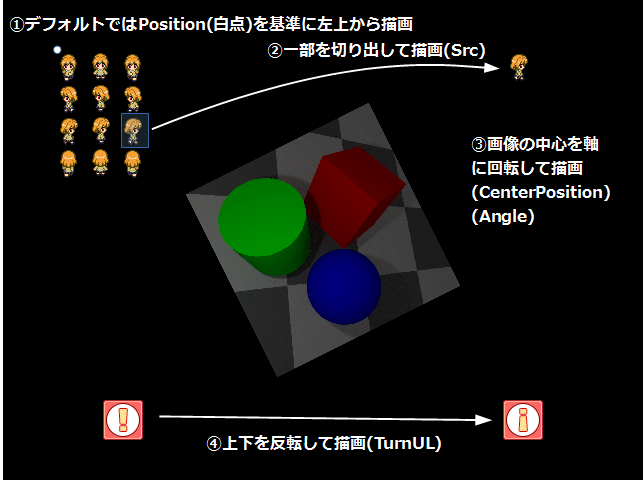

## テクスチャオブジェクト2D (TextureObject2D)

### 概要

[オブジェクト2Dクラス](./Object2D.md)を拡張し、描画するテクスチャやそれに適用するオプションを設定可能にした2D描画オブジェクトです。描画するテクスチャ、そのテクスチャの切り出し範囲、反転描画のフラグなどを設定することができます。

プレイヤー、敵キャラクター、弾などのゲーム中にて毎フレーム更新される描画オブジェクトを定義するにはこのテクスチャオブジェクト2Dが適しており、例えば図よりSrcにテクスチャ上での切り出し範囲を設定することで、連番テクスチャの導入が可能です。他にも上下反転(TurnUL)や描画の中心軸(CenterPosition)を設定してからの回転描画が可能です。

逆に、マップチップや背景オブジェクトなどほとんど更新せずとも大量に描画する必要のあるテクスチャを扱う際には[マップオブジェクト2D](./MapObject2D.md)が適しています。

テクスチャについては、[テクスチャ](../Graphics/Texture2D.md)の項を御覧ください。
### 主なメソッド

なし

### 主なプロパティ

| 名称 | 説明 |
|---|---|
| Texture | 描画する2Dテクスチャのハンドル |
| AlphaBlendMode | テクスチャ描画の際に適用されるアルファブレンドの種類 |
| CenterPosition | テクスチャに適用する変換(拡大、回転、移動)の基準位置(親から見た相対座標にて設定) |
| Color | テクスチャ描画の際の合成色のRGBA値を0~255の間で指定(Aの値を255未満にすると透明になる。)|
| DrawingPriority | 描画の優先順位|
| TurnLR | テクスチャ描画の左右反転フラグ |
| TurnUL | テクスチャ描画の上下反転フラグ |
| Src | テクスチャ上の描画する切り出し範囲 |
| TextureFilterType | 描画時のテクスチャフィルタ(近傍補間:Nearestもしくは線形補間:Linear) |

### 主なイベント

なし

### 使用方法

TextureObject2Dクラスのサンプルです。

* include_basic_sample TextureObject2D_Basic

