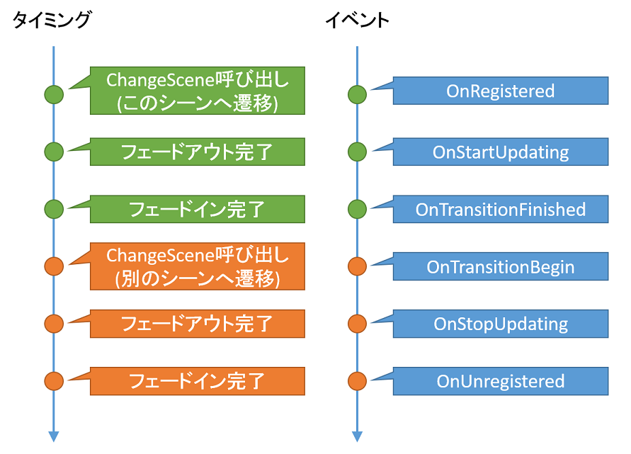

## シーン (Scene)

### 概要

ロゴ画面、タイトル画面、ゲーム画面、ゲームオーバー画面といったゲーム画面を継承により定義します。
シーン自体には画像を描画する機能はなく、実際に画像を表示するためにはシーンにレイヤーを登録する必要があります。
レイヤーを複数保持しレイヤーを管理する機能を持っています。

### 主なメソッド

| 名称 | 説明 |
|---|---|
| AddLayer | このシーンにレイヤーを追加します。 |
| RemoveLayer | このシーンからレイヤーを取り除きます。 |
| Dispose | このシーンを破棄(消去)します。 |

これらの操作は、実際にはメソッドを呼び出したフレームの最後に処理されるのでご注意ください。

### 主なプロパティ

| 名称 | 説明 |
|---|---|
| HDRMode| このシーンに描画された結果をHDRとして記録します。HDRの場合、グレアブルームといったポストエフェクトを使用する際に効果を発揮します。 |

### 主なイベント

| 名称 | 説明 |
|---|---|
| OnUpdating | ObjectのOnUpdateとLayerのOnUpdatingが実行される前に毎フレーム実行される更新イベント |
| OnUpdated | ObjectのOnUpdateとLayerのOnUpdatedが実行された後に毎フレーム実行される更新イベント |
| OnRegistered | Engineへ追加されたときに一度だけ実行されるイベント |
| OnStartUpdating | このシーンのUpdateが実行され始めるときに一度だけ実行されるイベント |
| OnTransitionFinished | トランジション終了時にDoEvents関数内で呼び出されるイベント |
| OnTransitionBegin | このシーンから別のシーンに切り替わり始める際に一度だけ呼び出されるイベント |
| OnStopUpdating | このシーンのUpdateが呼ばれなくなるときに一度だけ実行されるイベント |
| OnUnregistered | このシーンのUpdateが停止するときに一度だけ実行されるイベント |
| OnDispose | このシーンが破棄される際に一度だけ呼び出されるイベント |

`OnRegisterd`などのシーン遷移にかかわるイベントは、以下の図のようなタイミングで呼び出されます。詳しくは[イベント機能](EventSystem.md)をご覧ください。

### 使用方法

ほぼ全てのサンプルで使用されているので、そちらを参照してください。
