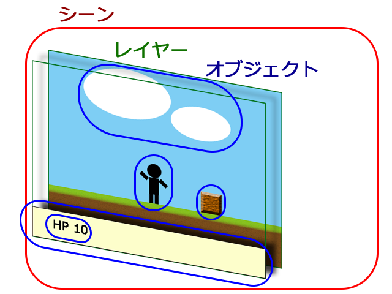

## 基本設計

AmusementCreatorsEngineにより製作されるゲームは主にシーン、レイヤー、オブジェクトの3つの要素で構成されています。

シーンはロゴ画面、タイトル画面、ゲーム画面、ゲームオーバー画面といったゲームの画面を示します。シーン自体には画像を描画する機能はなく、実際に画像を表示するためにはシーンにレイヤーを使用する必要があります。レイヤーを複数保持しレイヤーを管理する機能を持っています。

レイヤーはパラメーター等を表示しているUI、キャラクターが居るフィールドといったゲームの画面内の大まかな描画先を示します。レイヤー自体にも画像を表示する機能はなく、実際に画像を描画するためにはレイヤーにオブジェクトを登録する必要があります。オブジェクトを複数保持しオブジェクトを管理する機能を持っています。

オブジェクトはプレイヤーキャラクター、障害物、弾といったゲーム内の要素を示します。レイヤー内に存在するオブジェクトが実際に画像を表示します。沢山の種類があり、単純に画像を表示するものから文字やエフェクトを表示するオブジェクトもあります。

図で示すと以下のようになります。

この図では、ゲーム画面を示すシーンの中にパラメーターを表示しているUIとキャラクターが居るフィールドを示すレイヤーが存在します。
パラメーターを表示しているUIの中にライフゲージといったオブジェクト、フィールドにキャラクターや障害物といったオブジェクトが存在します。
このような構成が基本であり、例えば、3Dゲームを製作する場合(※)はフィールドをレイヤー2Dからレイヤー3Dに差し替えることで実現でき、ポーズ中の
メニューを出したい場合はポーズ中のメニューを示すレイヤーとオブジェクトを追加することで実現できます。オブジェクトも画像を表示するオブジェクトや文字を表示するオブジェクト等が存在します。

※　現在のバージョンではLayer3Dは開発中です。

さらにシーン、レイヤー、オブジェクトに対して継承(もしくはそれに準ずる機能)することで、様々なイベントを持たせることができます。例えば、毎フレーム実行されるイベント、消滅した時に実行されるイベントなどです。これらのイベントによりゲームの挙動を構築していきます。

ただ、これだけの要素だけでは綺麗な描画は実現できません。実際には上記にあげた3つの要素以外にテクスチャやサウンドといったリソースが存在します。例えば画像を表示するオブジェクトならテクスチャを読み込み設定することで画像を描画できます。文字を表示するオブジェクトならフォントと文字列を設定することで文字を描画できます。

