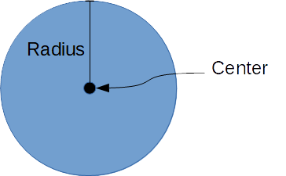

## 円形コライダ (CircleShape)

### 概要

円系のコライダを扱うクラスです。図形の概形はプロパティによって指定し、それぞれのプロパティの意味は以下の図のようになっております。

Object2D同士の衝突判定に使用することが可能です。くわしくは[オブジェクト2D](../2D/Object2D.md)と[2Dコライダ](./Collider2D.md)の項を参照してください。

### 主なプロパティ

| 名称 | 説明 |
|---|---|
| Center | 円の中心位置 |
| Radius | 円の半径 |

### 使用方法

サンプル準備中...