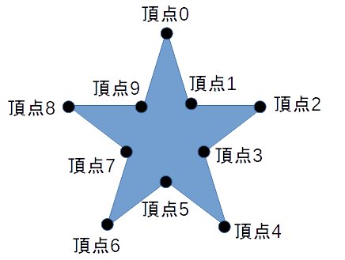

## 多角形コライダ (PolygonCollider)

### 概要

多角形のコライダを扱うクラスです。

図形の形状はメソッドで頂点を追加・設定することで構成します。

以下の図は10個の頂点を用いて星型の多角形を表現した例です

Object2D同士の衝突判定に使用することが可能です。くわしくは[オブジェクト2D](../2D/Object2D.md)と[2Dコライダ](./Collider2D.md)の項を参照してください。

### 主なメソッド

| 名称 | 説明 |
|---|---|
| AddVertex | このポリゴンに新たな頂点を追加する |
| GetVertex | 引数で指定したインデックスのポリゴンの頂点を取得する |
| SetVertex | 引数で指定したインデックスのポリゴンの頂点を設定する |
| ClearVertexes | このポリゴンの頂点全てをクリアする |

### 主なプロパティ

| 名称 | 説明 |
|---|---|
| IsValid | このポリゴンが正当か否かを取得する |
| VertexesNum | このポリゴンの頂点数を取得する |

### 使用方法

サンプル準備中...