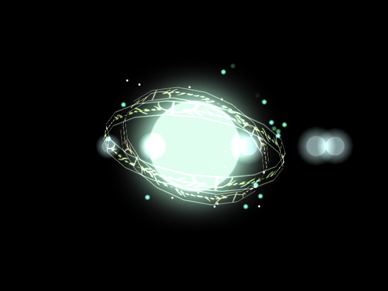

## エフェクト (Effect)

### 概要

エフェクトを定義します。グラフィックスから生成できます。Effekseerから出力したファイルから作成できます。このクラスは情報を持つだけであり、表示するためにはエフェクトオブジェクト2Dやエフェクトオブジェクト3Dに渡す必要があります。

### 主なメソッド

なし

### 主なプロパティ

なし

### 主なイベント

なし

### 使用方法

エフェクトオブジェクト2Dのサンプルを参照してください。
