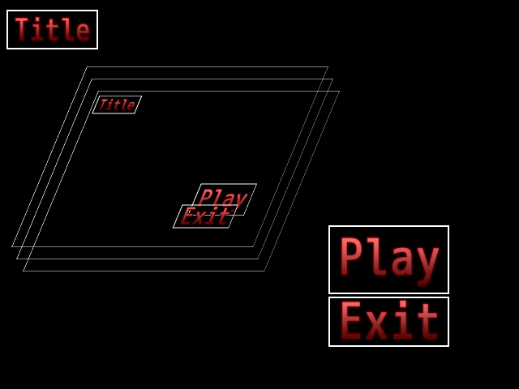

## 画像パッケージ (ImagePackage)

### 概要

画像パッケージを定義します。画像パッケージは複数の画像を1つのファイルに格納したフォーマットです。画像だけでなくその画像の名称や画像パッケージに変換される前のファイル、例えばPSDといったファイルで画像が配置されていた位置の情報も格納されています。元々画像が配置されていた位置に画像が描画されるようにプログラムを組むことで、画像編集ソフトで配置を決めてプログラムで画像を表示ができます。つまり、画像編集ソフトでユーザーインターフェースの配置を設定できるようになります。

現在、画像パッケージはImagePackageGeneratorを用いてPSDファイルから生成できます。そのツールを用いて生成されたファイルは[グラフィックスクラス(Graphics)](./Graphics.md)のCreateImagePackage関数を用いて読み込めます。

画像パッケージのファイル(.aip)を生成するには画像パッケージジェネレーターツールを使用します。
詳しくは、[画像パッケージジェネレーター](../Tool/ImagePackageGenerator.md)の項目をご覧ください。

### 主なメソッド

なし

### 主なプロパティ

なし

### 主なイベント

なし

### 使用方法

画像パッケージから画像を読み込み、配置するサンプルです。

* include_application_sample ImagePackageUI_Basic
