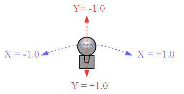

## ジョイスティック (Joystick)

### 概要

ジョイスティックからのからの入力を提供します。

[エンジン](../Basic/Engine.md)のJoystickプロパティから現在のフレームのジョイスティックの状態を持った当クラスのインスタンスを取得できます。

ジョイスティックが持つボタンならびにアナログスティックの総数、ボタンの押下状態ならびにアナログスティックの傾倒状態を調べることが出来ます。

#### ボタンの押下状態

押下状態は前フレームと当フレームの押下状態によって表現され、以下の4通りとなります。(○・・・押している、✕・・・押していない)

|状態|前フレーム|当フレーム|
|---|---|---|
|Free|✕|✕|
|Release|○|✕|
|Push|✕|○|
|Hold|○|○|

#### アナログスティックの傾倒状態

アナログスティックの傾倒度合いは、X方向とY方向それぞれに関して図に示すように実数値で表現されます。

### 主なメソッド

| 名称 | 説明 |
|---|---|
| GetJoystickName | ジョイスティックの名称 |
| GetButtonsCount | ジョイスティックの持つボタンの総数 |
| GetAxesCount | ジョイスティックの持つアナログスティックの数 |
| GetButtonState | 指定した番号のボタンの押下状態 |
| GetAxisState | 指定した番号のアナログスティックの傾倒状態 |

### 主なプロパティ

なし

### 主なイベント

なし

### 使用方法

Joystickクラスのサンプルをご覧ください。
