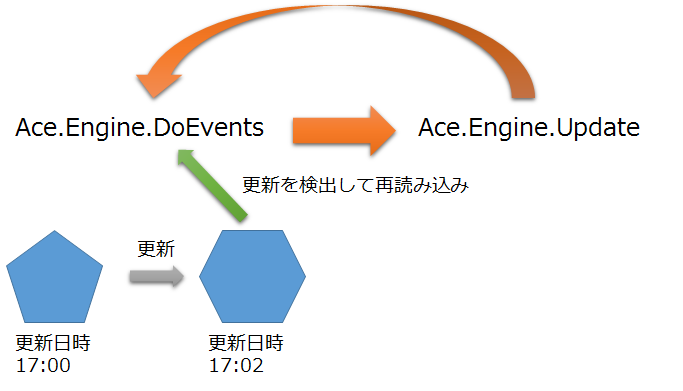

## リロード

### 概要

AC-Engineはリロードという機能があります。これは、ゲーム起動中に既に読み込んでいる画像等のファイルを書き換えるとゲーム起動中でも変更が反映されるという機能です。
現在は、テクスチャ2D、エフェクト、音源のみ対応しております。

変更が反映されるタイミングは2つあります。1つ目はゲームのウインドウからフォーカスが外れ再度フォーカスが戻った時です。これはゲーム画面から一旦目を離し、
編集ツールを起動し画像等の編集をして再度ゲーム画面を操作しようとした時に発生します。2つ目はEngine.Reloadが実行された時です。何らかの理由で
任意のタイミングで再読み込みを発生させたい時、この関数を実行すると変更が反映されます。

いずれの機能もAC-Engineの初期化時のオプション、EngineOption.IsReloadingEnabledをtrueにする必要があります。

ファイルが変更されたかは更新日時によって確認しており、再読み込みのタイミングで前に読み込んだ時と更新日時が違うとき変更を反映させています。そのため、更新日時が変わらないような編集の仕方を行ってしまった場合、変更は反映されません。

