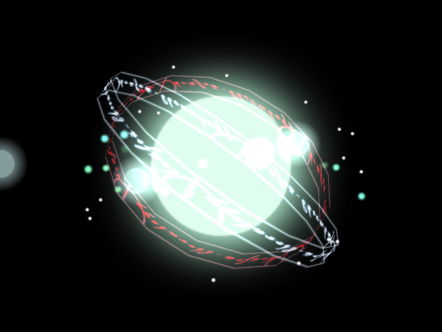
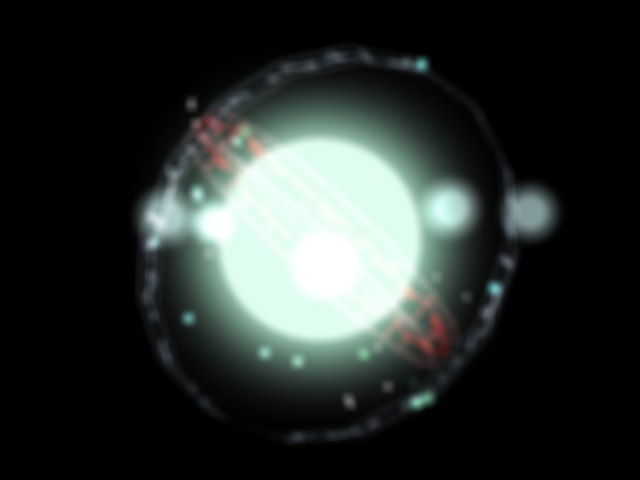

## ポストエフェクト (PostEffect)

### 概要

ポストエフェクトは画面に対し何らかの効果を加えて表示される映像を変化させる機能です。
現在、ポストエフェクトを設定できる対象はレイヤーのみで、レイヤーに設定した場合、
既に描画済みのレイヤーとポストエフェクトが設定されたレイヤーの描画した結果全てに対して効果を与えます。
また、試験的にカメラ3Dにも設定でき、カメラで描画した結果に対して効果を与えます。

ポストエフェクトは既に用意されているポストエフェクトの他に自分でポストエフェクトを開発できます。
詳細は、カスタムポストエフェクトの項目で説明しています。

