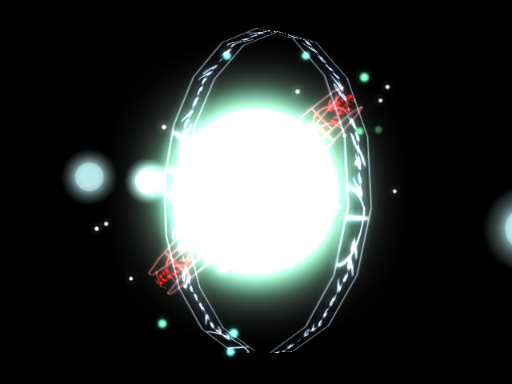

## ライトブルーム (PostEffectLightBloom)

### 概要

画面で一定以上明るい画素をぼかして加算することで、光が溢れているような表現を与えるポストエフェクトです。
例えば、エフェクトや加算されたテクスチャオブジェクトと組み合わすことで大きな効果を発揮します。

更に、HDR表示の場合は通常の0～255の画素では表現できない値もぼかせます。

具体的な処理としては元の画像から閾値を超えた画素を抽出し、閾値を超えた分の輝度をぼかして元の画像に加算しています。

### 主なメソッド

なし

### 主なプロパティ

| 名称 | 説明 |
|---|---|
| Intensity| ぼけの強さ。値が大きいほど光がぼけます。 |
| Threshold| 閾値。この値を超えた画素がぼかされます。255を1.0とした数値を指定します。HDR表示の場合は1.0以上の値も指定可能です。 |
| Exposure | 露光の強さ。この値が大きいほどぼけた光が強くなります。 |
| IsLuminanceMode | RGBでなく、輝度を参照してぼかす色を決定します。 |

### 使用方法

ライトブルームをかけるサンプルです。

* include_basic_sample PostEffect_LightBloom
