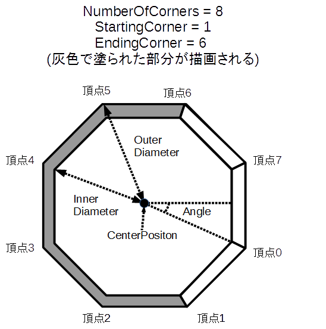

## 弧 (ArcShape)

### 概要

弧を扱うクラスです。図形の概形はプロパティによって指定し、それぞれのプロパティの意味は以下の図のようになっております。

図形の描画並びに衝突判定に使用することが可能です。くわしくは[図形オブジェクト2D](../2D/GeometryObject2D.md)と[図形](./Shape.md)の項を参照してください。

### 主なメソッド

特になし

### 主なプロパティ

| 名称 | 説明 |
|---|---|
| Position | 中心位置 |
| OuterDiameter | 外径 |
| InnerDiameter | 内径 |
| Angle | 回転角度（度数） |
| NumberOfCorners | 外径・内径の頂点数 |
| StartingCorner | 頂点の開始頂点(0 <= StartingCorner < EndingCorner <= NumberOfCorners) |
| EndingCorner | 頂点の終了インデックス(0 <= StartingCorner < EndingCorner <= NumberOfCorners) |

### 主なイベント

特になし

### 使用方法

[図形オブジェクト2D](../2D/GeometryObject2D.md)のページに描画サンプル、[図形](./Shape.md)のページに衝突判定のサンプルがあります。