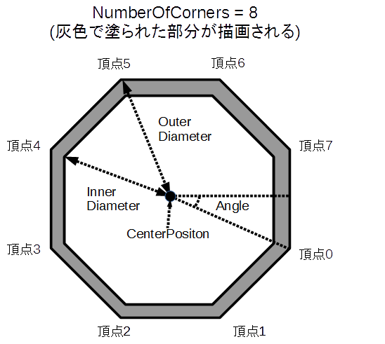

## 円 (CircleShape)

### 概要

円を扱うクラスです。図形の概形はプロパティによって指定し、それぞれのプロパティの意味は以下の図のようになっております。

### 主なメソッド

特になし

### 主なプロパティ

| 名称 | 説明 |
|---|---|
| Position | 円の中心位置 |
| OuterDiameter | 円の外径 |
| InnerDiameter | 円の内径 |
| Angle | 円の回転角度（度数）|
| NumberOfCorners | 外径・内径の頂点数 |

### 主なイベント

特になし

### 使用方法

undefined