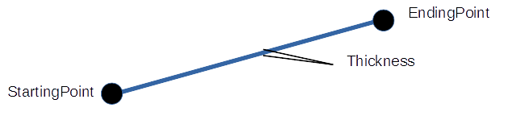

## 線分 (LineShape)

### 概要

線分を扱うクラスです。図形の概形はプロパティによって指定し、それぞれのプロパティの意味は以下の図のようになっております。

図形の描画並びに衝突判定に使用することが可能です。くわしくは[図形オブジェクト2D](../2D/GeometryObject2D.md)と[図形](./Shape.md)の項を参照してください。

### 主なメソッド

特になし

### 主なプロパティ

| 名称 | 説明 |
|---|---|
| StaringPosition | 線分の始点 |
| EndingPosition | 線分の終点 |
| Thickness | 線分の太さ|

### 主なメソッド

特になし

### 使用方法

undefined