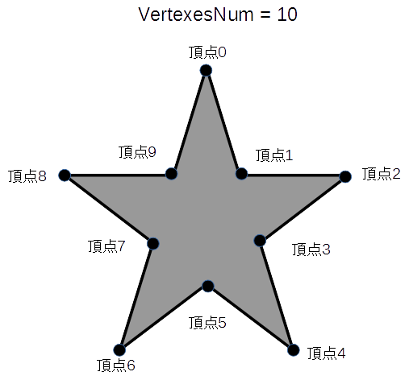

## 多角形 (PolygonShape)

### 概要

多角形を扱うクラスです。図形の概形はプロパティによって指定し、それぞれのプロパティの意味は以下の図のようになっております。

図形の描画並びに衝突判定に使用することが可能です。くわしくは図形オブジェクト2DとShapeクラスの項を参照してください。

### 主なメソッド

| 名称 | 説明 |
|---|---|
| AddVertex | 多角形を構成する頂点を追加する。 |
| ClearVertex | 多角形を構成する頂点をすべてクリアする。  |
| GetVertexesNum | 多角形を構成する頂点の数を取得する。  |

### 主なプロパティ

特になし

### 主なイベント

特になし

### 使用方法

undefined