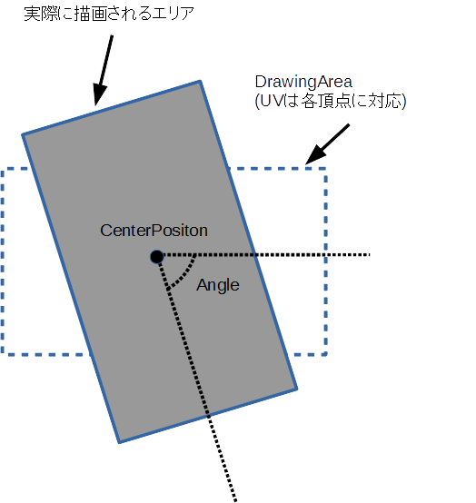

## 矩形 (RectangleShape)

### 概要

矩形を扱うクラスです。図形の概形はプロパティによって指定し、それぞれのプロパティの意味は以下の図のようになっております。

図形の描画並びに衝突判定に使用することが可能です。くわしくは[図形オブジェクト2D](../2D/GeometryObject2D.md)と[図形](./Shape.md)の項を参照してください。

### 主なメソッド

特になし

### 主なプロパティ

| 名称 | 説明 |
|---|---|
| DrawingArea | 描画の範囲 |
| UV | UVの範囲  |
| CenterPosition | 回転の中心位置(左上基準)  |
| Angle | 回転角度 |

### 主なイベント

特になし

### 使用方法

[図形オブジェクト2D](../2D/GeometryObject2D.md)のページに描画サンプル、[図形](./Shape.md)のページに衝突判定のサンプルがあります。