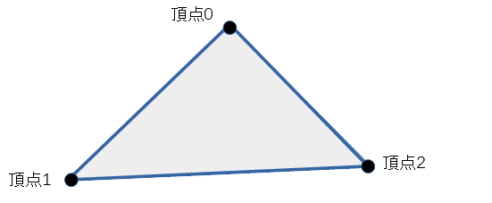

## 三角形 (TriangleShape)

### 概要

三角形を扱うクラスです。図形の概形はプロパティによって指定し、それぞれのプロパティの意味は以下の図のようになっております。

図形の描画並びに衝突判定に使用することが可能です。くわしくは図形オブジェクト2DとShapeクラスの項を参照してください。

### 主なメソッド

特になし

### 主なプロパティ

特になし

### 主なメソッド

| 名称 | 説明 |
|---|---|
| GetPointByIndex | 指定した番号の頂点の位置を取得する。(頂点番号:0~2) |
| SetPointByIndex | 指定した番号の頂点の位置を設定する。(頂点番号:0~2)  |
| GetUVByIndex | 指定した番号の頂点のUV値を取得する。(頂点番号:0~2) |
| SetUVByIndex | 指定した番号の頂点のUV値を設定する。(頂点番号:0~2)  |

### 使用方法

undefined