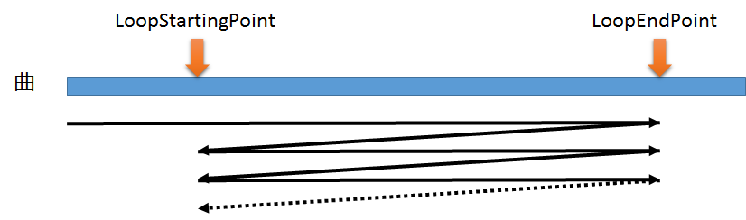

## 音源 (SoundSource)

### 概要

音ファイルから生成された音の情報を定義します。このクラスは音の情報を格納しているだけであり、実際に音を再生するにはこれを[サウンド](./Sound.md)に渡す必要があります。

このクラスには音のループポイントを設定できます。音をループさせるにはIsLoopingModeをtrueにします。ループポイントを設定していない場合、音を最後まで再生したら最初に戻ってループします。
LoopStartingPoint及び、LoopEndPointを設定すると、先頭から音を再生しLoopEndPointに到達したらLoopStartPointの位置に戻って再開します。

### 主なメソッド

なし

### 主なプロパティ

| 名称 | 説明 |
|---|---|
| LoopStartingPoint | ループポイントの開始地点 |
| LoopEndPoint | ループポイントの終了地点 |
| IsLoopingMode | 音がループするか |
| Length | 音の長さ |

### 主なイベント

なし

### 使用方法

サウンドのサンプルを参照してください。
