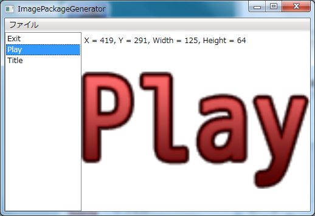

# 画像パッケージジェネレーター
画像パッケージジェネレーターを使用して、AC-Engineで使用可能な画像パッケージを生成できます。

PSDファイルを読み込んだ後、「出力」ボタンを押すと、画像パッケージファイルが生成されます。

画像パッケージファイルにはPSDファイルの下のレイヤーから順に、名称、画像、元のPSDファイル上での配置が保存されます。元のPSDファイル上での配置の情報を使用することで、PSDファイルと同じ配置をアプリケーション上で実現できます。

